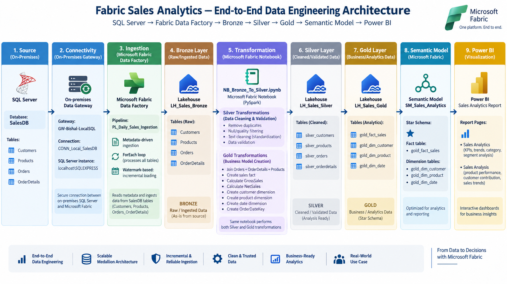

# Fabric Sales Analytics Portfolio

An end-to-end **Microsoft Fabric data engineering and analytics project** demonstrating metadata-driven ingestion, watermark-based incremental loading, Medallion Architecture, PySpark transformations, dimensional modeling, semantic modeling, and Power BI analytics.

The project uses a SQL Server sales database as the source and processes the data through Bronze, Silver, and Gold layers before exposing the final model through Power BI.

---

## Architecture



### End-to-End Data Flow

```text
SQL Server (SalesDB)
        │
        ▼
On-Premises Data Gateway
        │
        ▼
Fabric Data Factory
Metadata-Driven Pipeline
        │
        ▼
LH_Sales_Bronze
        │
        ▼
NB_Bronze_To_Silver.ipynb
        │
        ├── Silver Transformations
        │
        ▼
LH_Sales_Silver
        │
        ▼
Gold Transformations
        │
        ▼
LH_Sales_Gold
        │
        ▼
SM_Sales_Analytics
        │
        ▼
Power BI Sales Analytics
```

---

## Project Overview

This project demonstrates a complete data engineering workflow using Microsoft Fabric.

The solution covers:

* SQL Server source data
* On-premises connectivity through a Data Gateway
* Metadata-driven ingestion
* Watermark-based incremental loading
* Bronze raw data storage
* Silver data cleansing and validation
* Gold dimensional modeling
* PySpark transformations
* Fabric semantic modeling
* Power BI analytics

The project follows the **Medallion Architecture** pattern:

```text
Bronze → Silver → Gold
```

---

## Technologies

* **Microsoft Fabric**
* **Fabric Data Factory**
* **Fabric Lakehouse**
* **Fabric Notebooks**
* **PySpark**
* **SQL Server**
* **T-SQL**
* **Power BI**
* **DAX**
* **Medallion Architecture**
* **Metadata-Driven Pipelines**
* **Incremental Loading**
* **Watermark Pattern**
* **Star Schema**

---

## Source Data

The project uses a SQL Server database named:

```text
SalesDB
```

Source tables:

| Table          | Purpose                     |
| -------------- | --------------------------- |
| `Customers`    | Customer information        |
| `Products`     | Product information         |
| `Orders`       | Order-level information     |
| `OrderDetails` | Order line-item information |

The source database and sample data can be recreated using the SQL scripts in the [`sql/`](sql/) directory.

---

# Data Engineering

## Bronze Layer

**Lakehouse:** `LH_Sales_Bronze`

The Bronze layer stores data ingested from SQL Server with minimal transformation.

Source tables:

* Customers
* Products
* Orders
* OrderDetails

The ingestion process is designed to support incremental loading rather than repeatedly loading the complete source dataset.

---

## Metadata-Driven Incremental Pipeline

**Pipeline:** `PL_Daily_Sales_Ingestion`

The ingestion pipeline uses a metadata-driven pattern to process multiple source tables through a reusable ForEach workflow.

### Pipeline flow

```text
Metadata Lookup
      ↓
ForEach Table
      ↓
Lookup Current Watermark
      ↓
Dynamic Source Query
      ↓
Copy Data to Bronze
      ↓
Update Watermark
```

The pipeline uses a SQL Server watermark table:

```text
dbo.Ingestion_Watermark
```

The watermark tracks the latest `LastModifiedDate` processed for each source table.

This allows subsequent pipeline executions to retrieve only records newer than the stored watermark.

For the initial load, the pipeline can load the complete table when no watermark exists.

Detailed pipeline documentation is available in [`docs/pipeline.md`](docs/pipeline.md).

---

# Silver Layer

**Lakehouse:** `LH_Sales_Silver`

Silver transformations are implemented using the Fabric notebook:

```text
NB_Bronze_To_Silver.ipynb
```

The notebook performs data quality and transformation operations including:

* Duplicate removal
* Null filtering
* Data validation
* Text cleaning
* Trimming values
* Standardizing text casing
* Quantity validation
* Unit price validation
* Discount validation

Silver tables:

* `silver_customers`
* `silver_products`
* `silver_orders`
* `silver_orderdetails`

Detailed documentation is available in [`docs/silver-layer.md`](docs/silver-layer.md).

---

# Gold Layer

**Lakehouse:** `LH_Sales_Gold`

The same `NB_Bronze_To_Silver.ipynb` notebook also performs the Gold transformations.

The Gold layer converts the cleaned Silver data into an analytics-oriented dimensional model.

### Sales Fact

`gold_fact_sales`

The fact table is created by joining:

```text
silver_orderdetails
        +
silver_orders
        +
silver_products
```

The transformation calculates:

* `GrossSales`
* `NetSales`

Where:

```text
GrossSales = Quantity × UnitPrice
```

```text
NetSales = (Quantity × UnitPrice) - Discount
```

### Dimensions

The Gold layer contains:

* `gold_dim_customer`
* `gold_dim_product`
* `gold_dim_date`

The date dimension is generated dynamically from the minimum and maximum order dates and contains attributes such as:

* Date
* Year
* Month Number
* Month Name
* Quarter
* Day
* Day Name
* Day of Week Number

Detailed documentation is available in [`docs/gold-layer.md`](docs/gold-layer.md).

---

# Semantic Model

**Semantic Model:** `SM_Sales_Analytics`

The semantic model uses the Gold layer as its analytical foundation.

### Model structure

```text
                 gold_dim_customer
                         │
                         │
                         ▼
gold_dim_product ── gold_fact_sales ── gold_dim_date
```

The model follows a **star schema** with:

* One central fact table
* Customer dimension
* Product dimension
* Date dimension

Detailed documentation is available in [`docs/semantic-model-powerbi.md`](docs/semantic-model-powerbi.md).

---

# Power BI Analytics

The final analytical layer is a Power BI Sales Analytics report containing two pages:

### Page 1 — Sales Analytics

Provides a high-level view of:

* Total Sales
* Total Orders
* Total Quantity
* Average Order Value
* Sales trend
* Sales by category
* Sales by customer segment

### Page 2 — Sales Analysis

Provides deeper analysis of:

* Sales by product
* Sales by month
* Gross Sales vs Total Sales by category
* Top-performing products

The report includes interactive filtering by:

* Date
* Category
* Customer Segment

Power BI screenshots are available in [`powerbi/screenshots/`](powerbi/screenshots/).

Detailed report documentation is available in [`powerbi/README.md`](powerbi/README.md).

---

# Key Metrics

The Power BI report includes metrics such as:

| Metric              | Description                       |
| ------------------- | --------------------------------- |
| Total Sales         | Total net sales                   |
| Gross Sales         | Quantity multiplied by unit price |
| Total Orders        | Number of orders                  |
| Total Quantity      | Total quantity sold               |
| Average Order Value | Average sales value per order     |

---

# Project Structure

```text
fabric-sales-analytics-portfolio/
│
├── architecture/
│   └── fabric-sales-analytics-architecture.png
│
├── docs/
│   ├── pipeline.md
│   ├── silver-layer.md
│   ├── gold-layer.md
│   └── semantic-model-powerbi.md
│
├── fabric/
│   ├── bronze/
│   ├── silver/
│   │   └── NB_Bronze_To_Silver.ipynb
│   ├── gold/
│   ├── pipelines/
│   └── README.md
│
├── powerbi/
│   ├── README.md
│   └── screenshots/
│       ├── page-1-sales-analytics.png
│       └── page-2-sales-analysis.png
│
├── sql/
│   ├── 01_create_salesdb.sql
│   ├── 02_create_watermark.sql
│   └── 03_test_incremental_load.sql
│
└── README.md
```

---

# Key Engineering Concepts Demonstrated

### Metadata-Driven Ingestion

A reusable pipeline processes multiple source tables through metadata rather than creating separate hardcoded ingestion activities for every table.

### Incremental Loading

A watermark pattern based on `LastModifiedDate` allows the pipeline to identify newly created or modified records.

### Medallion Architecture

The project separates data processing into:

```text
Bronze → Raw/Ingested
Silver → Cleaned/Validated
Gold → Business/Analytics
```

### Dimensional Modeling

The Gold layer uses a star schema consisting of a sales fact table and supporting dimensions.

### Data Quality

Silver transformations include duplicate removal, null checks, validation rules, and basic standardization.

### Reusable Notebook Processing

A single Fabric notebook handles the Silver and Gold transformation stages.

---

# Project Documentation

| Area                      | Documentation                                                      |
| ------------------------- | ------------------------------------------------------------------ |
| Pipeline                  | [`docs/pipeline.md`](docs/pipeline.md)                             |
| Silver Layer              | [`docs/silver-layer.md`](docs/silver-layer.md)                     |
| Gold Layer                | [`docs/gold-layer.md`](docs/gold-layer.md)                         |
| Semantic Model & Power BI | [`docs/semantic-model-powerbi.md`](docs/semantic-model-powerbi.md) |
| Fabric Artifacts          | [`fabric/README.md`](fabric/README.md)                             |
| Power BI Report           | [`powerbi/README.md`](powerbi/README.md)                           |

---

# Project Status

Core components have been implemented:

* ✅ SQL Server source database
* ✅ Watermark table
* ✅ Metadata-driven ingestion pipeline
* ✅ Incremental loading
* ✅ Bronze Lakehouse
* ✅ Silver transformations
* ✅ Gold transformations
* ✅ Fact and dimension tables
* ✅ Star-schema semantic model
* ✅ Power BI report
* ✅ Architecture documentation
* ✅ Project documentation

---

# Disclaimer

This is a personal learning and portfolio project using demonstration data.

No confidential company data, credentials, production datasets, or proprietary business information are included.
